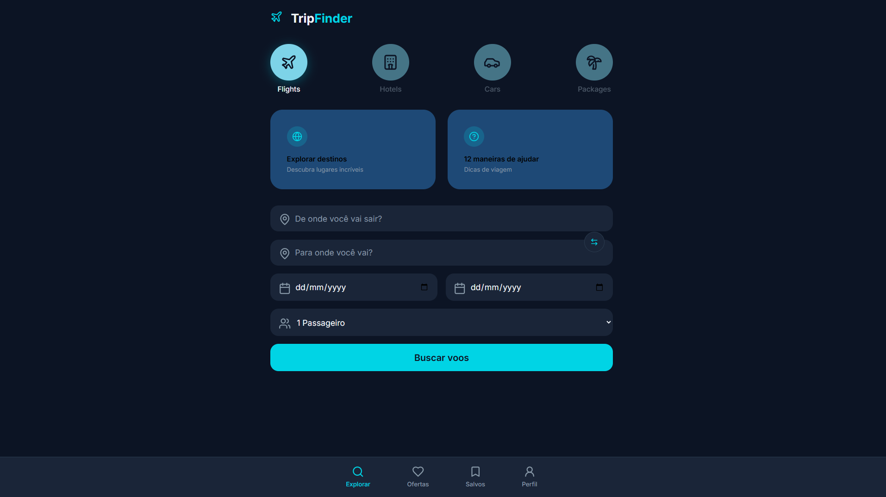

# TripFinder API ✈️🚌🚆

TripFinder is a backend API project designed to simulate a travel search platform, similar to services like Skyscanner.  
The API provides endpoints to search for **flights, buses, and trains**, serving as a foundation for a full-stack travel comparison application.

This project is currently under development and is part of my backend learning journey with **Node.js and Express**.

---

## 🚀 Features

- RESTful API architecture
- Modular route and controller structure
- Support for multiple transport types:
  - ✈️ Flights
  - 🚌 Buses
  - 🚆 Trains
- Environment variable support with dotenv
- CORS enabled for frontend integration
- Ready for future integration with real travel APIs

- ### 🔍 Search Interface


---

## 🛠️ Tech Stack

- **Node.js**
- **Express.js**
- **JavaScript (ES6+)**
- **Axios**
- **dotenv**
- **CORS**

---

## 📁 Project Structure

```bash
tripfinder-flights-api/
│
├── src/
│   ├── controllers/
│   │   ├── flights.controller.js
│   │   ├── buses.controller.js
│   │   └── trains.controller.js
│   │
│   ├── routes/
│   │   ├── flights.routes.js
│   │   ├── buses.routes.js
│   │   └── trains.routes.js
│   │
│   ├── services/
│   │   └── externalApiService.js
│   │
│   ├── app.js
│   └── server.js
│
├── public/
├── .env
├── .gitignore
├── package.json
└── README.md
▶️ Getting Started
1. Clone the repository
git clone https://github.com/your-username/tripfinder-flights-api.git
2. Install dependencies
npm install
3. Configure environment variables
Create a .env file:

PORT=5000
4. Run the server
npm start
The API will be available at:

http://localhost:5000
📡 API Endpoints (Example)
Flights
GET /api/flights/search
Buses
GET /api/buses/search
Trains
GET /api/trains/search
🧠 Project Status
🚧 In progress
This project is temporarily paused while I continue advancing in my Node.js course.
Future updates will include:

Integration with real travel APIs

Data normalization

Caching and performance improvements

Authentication and user features

👨‍💻 Author
Vitor Dutra Melo
Backend Developer focused on Node.js & REST APIs
📍 United Kingdom

📄 License
This project is licensed under the MIT License.
